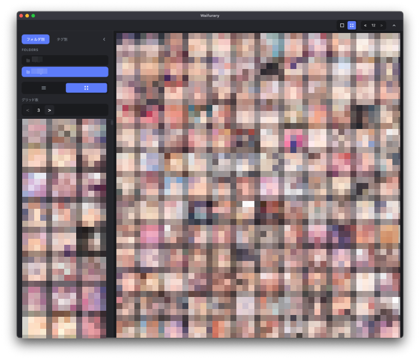

# Waifurary

A desktop application for collecting and managing waifu illustrations, URLs, and RSS feeds.



## features

- Grid and list views for browsing waifus.
- Add waifus via URL or RSS feed.
- Tagging and categorization of waifus.

### saved images are stored in

```
~/Library/Application Support/waifurary/images/
```

example:

```
~/Library/Application Support/waifurary/images/girls/<IMAGES>
```
